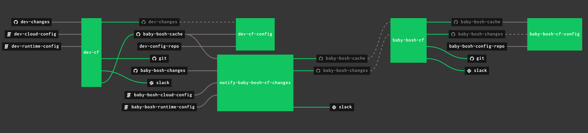
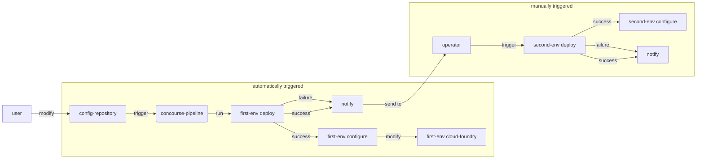
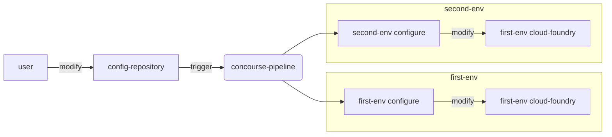

# Motivation
The story behind the functionality presented below comes from the clients that leverage Genesis Project in their environments to automate creation of CloudFoundry and it assisting components.\
At some point clients created a multi-env (>10 environments) genesis backed deployments for CloudFoundry using [`genesis repipe`](https://github.com/genesis-community/genesis/blob/main/docs/PIPELINES.md) to configure, design and generate Concourse pipeline.\
`genesis repipe` allows users to generate for each env two jobs, one for executing `genesis deploy $env` and second that notifies about the change `notify $env deployed`.\
At some point clients wanted to extend the functionality in that pipeline to for example include post-deploy steps like secret rotations per env, internal domains creations, application security groups configuration and bindings, and many more.\
Thanks to the fact that Genesis Project widely adopted [spruce](https://github.com/geofffranks/spruce), creation of such custom functionality was possible by appending to the generated pipeline a new tasks or jobs which were executing the desire features.

For the CloudFoundry the amount of such post-deploy features can be a vast list over the time. Also we would need a place to store for ex. definitions for ASG rules, organizations & spaces hierarchy and all kind of various bindings.\
For that purpose the custom implementation of each could be made, but this documentation and implementation covers the usage of [cf-mgmt]() project.\
[cf-mgmt docs]() include a variety of commands for end-users to create, modify or destroy resources on CloudFoundry using the code repository as a single source of truth medium to store each environment configuration under SVC system. By modifying the code in that repository the operators can manage the entire CloudFoundry foundation using the code vs CLI.

This approach brings both benefits and challenges, most recognized benefit is the fact that configuration is now stored as a single source of truth of the desired state, as well as it can be restored from any point of time thanks to the SVC system, allowing fast rollbacks and providing changes.\
One of the biggest challenge in that approach is the mindset shift that configuration is now not the result of applied commands to the platform directly (via CLI for example), but the code itself.

**This solution can still be used in parallel to the direct usage of CLI.\
Please check [Disabling single-source-of-truth of cf-mgmt](#disabling-single-source-of-truth-of-cf-mgmt).**
>Some other concepts that share principles similar to cf-mgmt:
>- [Infrastructure as a Code](https://www.techtarget.com/searchitoperations/definition/Infrastructure-as-Code-IAC)
>- [gitops approach](https://www.gitops.tech/)
>- [ArgoCD as example of gitops implementation](https://github.com/argoproj/argo-cd/blob/master/README.md)

# Table of Content
- [Diagrams & Architecture](#diagrams---architecture)
    + [Concourse pipeline](#concourse-pipeline)
    + [UX flow when providing a change](#ux-flow-when-providing-a-change)
    + [UX flow when only CF config changes](#ux-flow-when-only-cf-config-changes)
- [Setup](#setup)
  * [CloudFoundry](#cloudfoundry)
    + [Setup cf-mgmt UAA client](#setup-cf-mgmt-uaa-client)
    + [Push UAAC secret to the Vault](#push-uaac-secret-to-the-vault)
  * [cf-mgmt](#cf-mgmt)
    + [Get cf-mgmt CLI tools:](#get-cf-mgmt-cli-tools-)
      - [Export configuration, or initialise new one.](#export-configuration--or-initialise-new-one)
    + [New Concourse pipeline generation](#new-concourse-pipeline-generation)
  * [Deployment configuration](#deployment-configuration)
    + [Extending existing ci.yml](#extending-existing-ciyml)
      - [Add new environment configuration](#add-new-environment-configuration)
      - [Add new environment resource](#add-new-environment-resource)
      - [Add new environment config job](#add-new-environment-config-job)
    + [Disabling single-source-of-truth of cf-mgmt](#disabling-single-source-of-truth-of-cf-mgmt)
- [Manual](#manual)
  * [Create org and space](#create-org-and-space)
  * [Create user in org/space](#create-user-in-org-space)
  * [Create quotas and bind it to org/space](#create-quotas-and-bind-it-to-org-space)
  * [Create ASG's](#create-asg-s)
  * [Create and enable isolation segments](#create-and-enable-isolation-segments)
  * [Run UAAC CLI - Group Creation and Mapping example](#run-uaac-cli---group-creation-and-mapping-example)

# Diagrams & Architecture
### Concourse pipeline

### UX flow when providing a change

### UX flow when only CF config changes

# Setup
## CloudFoundry
### Setup cf-mgmt UAA client
Under the `deployments/cf/ops` directory declare a new feature, ex. `cf-mgmt-uaa-client` with the configuration as shown below:
```yaml
instance_groups:
- name: uaa
  jobs:
  - name: uaa
    properties:
      uaa:
        clients:
          cf_mgmt_client:
            resource_ids: none
            authorized-grant-types: client_credentials,refresh_token
            authorities: routing.router_groups.read,scim.write,scim.read,cloud_controller.admin
            autoapprove:
            scope: routing.router_groups.read,scim.write,scim.read,cloud_controller.admin
            secret: ((cf_mgmt_client_secret))

variables:
- name: cf_mgmt_client_secret
  type: password
```
This should create a new OAuth2 client in UAA called `cf_mgmt_client` and store the secret for it in the credhub under `/$env-bosh/$env-cf/cf_mgmt_client_secret`.\
Add it under your `$env.yml` in the `deployments/cf` directory:
```diff
---
genesis:
  env:         dev
  min_version: 2.8.4

kit:
  name: cf
  version: 2.2.0-rc.14
  features:
    - postgres-db
    - aws-blobstore
    (...)
+   - cf-mgmt-uaa-client
```

Run deploy for the environment you wish to apply it for.
```
genesis deploy $env
```
### Push UAAC secret to the Vault
As it is much easier to integrate Genesis toolkit with Vault then credhub for reading secrets, please push the UAAC client secret to the Vault.
```
safe set secret/dev/bosh/uaa/clients/cf_mgmt_client secret=$(credhub g -n /dev-bosh/dev-cf/cf_mgmt_client_secret | sed -n 's/value: //p')
```
**Feel free to change the path to something else if needed, please put the correct path under `cf-mgmt.$env.client_secret` keys.**

## cf-mgmt
### Get cf-mgmt CLI tools:
```bash
wget https://github.com/vmware-tanzu-labs/cf-mgmt/releases/download/v1.0.52/cf-mgmt-linux
wget https://github.com/vmware-tanzu-labs/cf-mgmt/releases/download/v1.0.52/cf-mgmt-config-linux

mv cf-mgmt-linux cf-mgmt
mv cf-mgmt-config-linux cf-mgmt-config
```
You may want to move those binaries somewhere else and alias them under you bash/zsh/any-sh profiles, but usually the range of use is unitary.

#### Export configuration, or initialise new one.
Initialisation should happen only if you are connecting cf-mgmt configuration to a brand new CF deployment. If there are Orgs/Spaces/Quotas/ASG's etc already setup you may want to export it instead of overriding.

From this repository root run:
```bash
#./ci/export-config.sh dev system.codex.starkandwayne.com
./ci/export-config.sh $env $system_domain

```
export-config documentation: https://github.com/vmware-tanzu-labs/cf-mgmt/blob/main/docs/export-config/README.md

This should create a new directory called `ci/config/$env` with configuration extracted from deployment. 

### New Concourse pipeline generation
**Skip this part if cf-mgmt is already present in your flow**\
From the root directory let's now run CI generation:
```bash
#./ci/cf-mgmt-config generate-concourse-pipeline --config-dir=ci/config/dev
./ci/cf-mgmt-config generate-concourse-pipeline --config-dir=ci/config/$env
```
This should create two things (if not existing already):
- a dir named `ci` with `tasks` subdir
- a yml file named `pipeline.yml`

>What that command did was it generated a `pipeline.yml` with a multiple Concourse `jobs` that all call the same `task` which just executes `cf-mgmt` binary with correct input of parameters for whatever resource needs to be modified on CloudFoundry side.

## Deployment configuration
### Extending existing ci.yml
In most cases the operations will focus around existing `ci.yml` and `ci` directory. The below guide covers most of the use-cases of providing new environment to the mix.\
The entire structure lives inside the `ci.yml`. Each env needs to be declared in three sections: `configuration`, `resources` and `jobs`.

All of the below steps are copy-paste based and should take no longer then 2 minutes to complete.\
The example below is using `$env == 'test-ci-mgmt'` so all examples can be copy-pasted and later replace all can be used to replace all `test-ci-mgmt` to something else
#### Add new environment configuration
Under `ci.yml` find the key `cf-mgmt`. It should look like this:
```yaml
cf-mgmt:
  env1:
    (...)
  env2:
    (...)
  etc...:
```
Add new env to it using a standard template of vars.yml from cf-mgmt. It should look similar to this:
```yaml
cf-mgmt:
  (... some existing envs ...)
  test-ci-mgmt:
    # your git repo uri, where config_dir is located
    git_repo_uri: "https://github.com/starkandwayne/demo-cf-deployments.git"
    git_repo_branch: latest-cf-aws-codex
    # your cf system domain, `genesis info $env` from cf deployment dir
    system_domain: "system.codex.starkandwayne.com"
    # UAA user created in first steps
    user_id: "cf_mgmt_client"
    client_secret: (( vault "secret/test-ci-mgmt/bosh/uaa/clients/cf_mgmt_client:secret" ))
    # log level logging for actions performed by cf-mgmt
    log_level: INFO
    # not used - deprecated
    time-trigger: 15m
    # path from git_repo_uri where config for $env is located, ci/config/$env
    config_dir: ci/config/test-ci-mgmt
    # provide if LDAP should be connected to create/modify users
    ldap_server: ""
    ldap_user: ""
    ldap_password: ""
    # deprecated, UAA user client_secret is used
    password: ""
```
>Even if LDAP is not used the parameters are required by `cf-mgmt`, it is okay to leave them empty.

#### Add new environment resource
To the `resources:` map in `ci.yml` add new `$env` git resource:
```yaml
resources:
- ((append))
- (... other configs ...)
- name: test-ci-mgmt-config-repo
  type: git
  source:
    # (( grab cf-mgmt.$env.* ))
    uri: ((grab cf-mgmt.test-ci-mgmt.git_repo_uri))
    branch: ((grab cf-mgmt.test-ci-mgmt.git_repo_branch))
    paths: ["((grab cf-mgmt.test-ci-mgmt.config_dir))"]
```
#### Add new environment config job
To the `jobs:` map in `ci.yml` add new jobs for our `$env`:
```yaml
jobs:
- ((append))
- (... some other jobs ...)
- name: test-ci-mgmt-cf-config
  plan:
  - get: test-ci-mgmt-config-repo
    trigger: true
  - get: test-ci-mgmt-changes
    passed: [test-ci-mgmt-cf]
  - get: baby-bosh-cache
    trigger: true
    passed: [test-ci-mgmt-cf]
  - task: create-orgs
    <<: &test-ci-mgmt-task
      file: test-ci-mgmt-config-repo/ci/tasks/cf-mgmt.yml
      input_mapping:
        config-repo: test-ci-mgmt-config-repo
    params:
      <<: &test-ci-mgmt-params
        SYSTEM_DOMAIN: ((grab cf-mgmt.test-ci-mgmt.system_domain))
        USER_ID: ((grab cf-mgmt.test-ci-mgmt.user_id))
        PASSWORD: ((grab cf-mgmt.test-ci-mgmt.password))
        CONFIG_DIR: ((grab cf-mgmt.test-ci-mgmt.config_dir))
        CLIENT_SECRET: ((grab cf-mgmt.test-ci-mgmt.client_secret))
        LOG_LEVEL: ((grab cf-mgmt.test-ci-mgmt.log_level))
      CF_MGMT_COMMAND: create-orgs
  - task: shared-domains
    <<: *test-ci-mgmt-task
    params:
      <<: *test-ci-mgmt-params
      CF_MGMT_COMMAND: shared-domains
  - task: create-security-groups
    <<: *test-ci-mgmt-task
    params:
      <<: *test-ci-mgmt-params
      CF_MGMT_COMMAND: create-security-groups
  - task: assign-default-security-groups
    <<: *test-ci-mgmt-task
    params:
      <<: *test-ci-mgmt-params
      CF_MGMT_COMMAND: assign-default-security-groups
  - task: delete-orgs
    <<: *test-ci-mgmt-task
    params:
      <<: *test-ci-mgmt-params
      CF_MGMT_COMMAND: delete-orgs
  - task: update-orgs-metadata
    <<: *test-ci-mgmt-task
    params:
      <<: *test-ci-mgmt-params
      CF_MGMT_COMMAND: update-orgs-metadata
  - task: create-org-private-domains
    <<: *test-ci-mgmt-task
    params:
      <<: *test-ci-mgmt-params
      CF_MGMT_COMMAND: create-org-private-domains
  - task: service-access
    <<: *test-ci-mgmt-task
    params:
      <<: *test-ci-mgmt-params
      CF_MGMT_COMMAND: service-access
  - task: share-org-private-domains
    <<: *test-ci-mgmt-task
    params:
      <<: *test-ci-mgmt-params
      CF_MGMT_COMMAND: share-org-private-domains
  - task: create-spaces
    <<: *test-ci-mgmt-task
    params:
      <<: *test-ci-mgmt-params
      CF_MGMT_COMMAND: create-spaces
  - task: delete-spaces
    <<: *test-ci-mgmt-task
    params:
      <<: *test-ci-mgmt-params
      CF_MGMT_COMMAND: delete-spaces
  - task: update-spaces
    <<: *test-ci-mgmt-task
    params:
      <<: *test-ci-mgmt-params
      CF_MGMT_COMMAND: update-spaces
  - task: update-spaces-metadata
    <<: *test-ci-mgmt-task
    params:
      <<: *test-ci-mgmt-params
      CF_MGMT_COMMAND: update-spaces-metadata
  - task: update-space-users
    <<: *test-ci-mgmt-task
    params:
      <<: *test-ci-mgmt-params
      CF_MGMT_COMMAND: update-space-users
  - task: update-space-quotas
    <<: *test-ci-mgmt-task
    params:
      <<: *test-ci-mgmt-params
      CF_MGMT_COMMAND: update-space-quotas
  - task: update-space-security-groups
    <<: *test-ci-mgmt-task
    params:
      <<: *test-ci-mgmt-params
      CF_MGMT_COMMAND: update-space-security-groups
  - task: update-org-users
    <<: *test-ci-mgmt-task
    params:
      <<: *test-ci-mgmt-params
      CF_MGMT_COMMAND: update-org-users
  - task: update-org-quotas
    <<: *test-ci-mgmt-task
    params:
      <<: *test-ci-mgmt-params
      CF_MGMT_COMMAND: update-org-quotas
  - task: isolation-segments
    <<: *test-ci-mgmt-task
    params:
      <<: *test-ci-mgmt-params
      CF_MGMT_COMMAND: isolation-segments
  - task: cleanup-org-users
    <<: *test-ci-mgmt-task
    params:
      <<: *test-ci-mgmt-params
      CF_MGMT_COMMAND: cleanup-org-users
```
### Disabling single-source-of-truth of cf-mgmt
It may be a case under some organizations that this approach should be only used to add stuff to CloudFoundry and not to worry about it desired state to be equal to the code.

To disable all checks we need to modify `ci/config/$env/cf-mgmt.yml` file.\
Some of the top flags that should be disabled to stop most of the synchronization:
```yaml
# to not remove isolation segments once created or existed already
enable-delete-isolation-segments: false
# dont unassign any SG if found
enable-unassign-security-groups: false
# disable if there are domains that are not in the code
enable-remove-shared-domains: false
```
For each org seperately it can be also tweaked, `ci/config/$env/$org/orgConfig.yml`.
```yaml
# disable removal of private domains under specific $org
enable-remove-private-domains: false
# same as above but for shared ones
enable-remove-shared-private-domains: false
# don't remove users from $org, regardless if they are in code or not
enable-remove-users: false
```
For each org we can also disable removal of `spaces` - `ci/config/$env/$org/spaces.yml`.
```yaml
# disable removal of spaces
enable-delete-spaces: false
```
To configure default spaces behaviour we can use `ci/config/$env/spaceDefaults.yml`.
```yaml
# dont unassign any SG's
enable-unassign-security-group: false
# dont remove space-specific users
enable-remove-users: false
```
# Manual
Manually executed steps documentation to manage the configuration of CloudFoundry via code.

## Create org and space
To create a new org and space just copy a template of existing one and modify it to your needs.\
Or run new init via `./cf-mgmt-config add-org --org test --peek`.\
For the sake of this testing/tutorial we assume `cf-mgmt-org` exists with space `cf-mgmt-space` in it.\
Take a look here for example: https://github.com/starkandwayne/demo-cf-mgmt-deployments/tree/main/config/cf-mgmt-org

## Create user in org/space
Same steps are for org or space, just modify space config vs org config ;-)\
First we need to create a new user in UAA or have connected LDAP.\
If you are using LDAP, just configure user in `ldap.yml` as docs says.\

Create new CloudFoundry user in UAA via `uaac` CLI:
```bash
uaac user add test --emails "test@test" --password test
uaac member add scim.read test
uaac member add clients.read test
```

Let's now add it under our `cf-mgmt-org`, modify `ci/config/test-ci-mgmt/cf-mgmt-org/orgConfig.yml`:
```diff
org-manager:
  ldap_users: []
  users:
  - admin
+ - test
```

Execute a dry run:
```bash
./local-cf-mgmt update-org-users
```
You should see output similar to this one:
```log
2022/07/25 12:38:50 I0725 12:38:50.904103 1786254 users.go:267] [dry-run]: Add User test to role manager for org cf-mgmt-org
```
And from the `cf cli`:
```bash
> cf org-users cf-mgmt-org
Getting users in org cf-mgmt-org as admin...

ORG MANAGER
  admin
  test

BILLING MANAGER
  No BILLING MANAGER found

ORG AUDITOR
  No ORG AUDITOR found
```

## Create quotas and bind it to org/space
Same steps are for org or space, just modify space config vs org config ;-)

Let's start with creating new quota. If you want to use existing one, just skip this step.

Create new file under `ci/config/test-ci-mgmt/org_quotas/` named `cf-mgmt-quota.yml` and copy `default` quota configuration to it.
```bash
cat default.yml > cf-mgmt-quota.yml
```
Modify config to your needs, example changes below:
```diff
total_private_domains: unlimited
total_reserved_route_ports: "100"
total_service_keys: unlimited
-app_instance_limit: unlimited
+app_instance_limit: 10
app_task_limit: unlimited
-memory-limit: 100G
+memory-limit: 20G
instance-memory-limit: unlimited
-total-routes: "1000"
+total-routes: "100"
total-services: unlimited
paid-service-plans-allowed: true
```

Now use this quota in `cf-mgmt-org`, modify `ci/config/test-ci-mgmt/cf-mgmt-org/orgConfig.yml`:
```diff
-named_quota: default
+named_quota: cf-mgmt-quota
```

Let's test that new quota:
```log
> ./local-cf-mgmt update-org-quotas
2022/07/25 13:16:47 I0725 13:16:47.884558 1837380 quota.go:419] [dry-run]: create org quota cf-mgmt-quota
2022/07/25 13:16:47 I0725 13:16:47.924608 1837380 quota.go:443] [dry-run]: assign quota dry-run-quota to org cf-mgmt-org
```

Verify the quota is applied:
```bash
cf quotas
cf org cf-mgmt-org
```
Should show new quota, it params, and that it is now used by `cf-mgmt-org`.

## Create ASG's
There are two types of ASG's: default ones and all others ;-)\
Each ASG is applied during `runtime`, `staging` or for both.\
Let's go first and create a new `default` ASG, `default` ones applies to both `staging` and `runtime` and are not scoped - they apply to entire CF deployment.

Under `ci/config/test-ci-mgmt/defaults_asgs/` create new file called `private_networks.json` with a content:
```json
[
  {
    "protocol": "tcp",
    "destination": "10.0.0.0-10.255.255.255",
    "ports": "443"
  },
  {
    "protocol": "tcp",
    "destination": "172.16.0.0-172.31.255.255",
    "ports": "443"
  },
  {
    "protocol": "tcp",
    "destination": "192.168.0.0-192.168.255.255",
    "ports": "443"
  }
]
```
And let's see if that applies:
```bash
> ./local-cf-mgmt create-security-groups
2022/07/25 13:40:30 I0725 13:40:30.85259 1868840 securitygroup.go:332] [dry-run]: creating securityGroup private_networks with contents [
  {
    "protocol": "tcp",
    "destination": "10.0.0.0-10.255.255.255",
    "ports": "443"
  },
  {
    "protocol": "tcp",
    "destination": "172.16.0.0-172.31.255.255",
    "ports": "443"
  },
  {
    "protocol": "tcp",
    "destination": "192.168.0.0-192.168.255.255",
    "ports": "443"
  }
]
```

Let's go ahead now and actually create the **global** ASG for our space `cf-mgmt-space`.\
Under `ci/config/test-ci-mgmt/asgs/` create new file called `cf-mgmt-asg.json` with a content:
```json
[
	{
		"protocol": "tcp",
		"ports": "7007,7008",
		"destination": "0.0.0.0/0",
		"code": 0,
		"type": 0
	}
]
```
Update the `config/cf-mgmt-org/cf-mgmt-space/spaceConfig.yml`
```diff
-enable-security-group: false
+enable-security-group: true
(...)
-named-security-groups: []
+named-security-groups: [cf-mgmt-asg]
```
And global config file `ci/config/test-ci-mgmt/cf-mgmt.yml`:
```diff
-enable-unassign-security-groups: false
+enable-unassign-security-groups: true # !!change it only if all ASGs are controlled by cf-mgmt!!
(...)
staging-security-groups:
 - public_networks
 - dns
+ - private_networks
```

Let's test if it works:
```bash
> ./local-cf-mgmt create-security-groups
2022/07/25 13:48:08 I0725 13:48:08.896168 1878661 securitygroup.go:332] [dry-run]: creating securityGroup cf-mgmt-asg with contents [
        {
                "protocol": "tcp",
                "ports": "7007,7008",
                "destination": "0.0.0.0/0",
                "code": 0,
                "type": 0
        }
]
```
```bash
> ./local-cf-mgmt update-space-security-groups

```

If we want to only create a security group for specific space and not actually share it globally there is a way.\
Under `ci/config/test-ci-mgmt/cf-mgmt-org/cf-mgmt-space/security-group.json` add a new security group.\
Then we need to enable this ASG create mode by turning this flag under `spaceConfig.yml`:
```diff
-enable-security-group: false
+enable-security-group: true
```

## Create and enable isolation segments
Isolation segments needs to be first installed by platform engineering team.\
Make sure the CF-Genesis-Kit has feature flag `isolation-segments` enabled, and that the `params:` section include the configuration of isolation segments.\
Use the names from kit `params:` to refer isolation segment.\
Example `cf-genesis-kit` configuration (available since `v2.2.1-rc.1` kit version):
```yaml
params:
  base_domain: cf.testing.example
  isolation_segments:
  - name: custom-params-group
    azs:
    - custom-az
    instances: 5
    vm_type: small-highmem
    network_name: ((cf_runtime_network))
    stemcell: test
    vm_extensions:
    - 100GB_ephemeral_disk
    - cf-router-network-properties
  - name: default-params-group
    azs:
    - z1 
```
To use `default-params-group` or `custom-params-group` segments created by above configuration we only need to edit config in `orgConfig.yml` or `spaceConfig.yml` and include them under `default_isolation_segment` / `isolation_segment` respectively.\
There is no command under `cf-mgmt-config` to add those.

**NOTE: The CloudFoundry never verifies if underlying infrastructure for Isolation Segments exists when performing cf/api operations. Meaning that you can create segments via cf CLI and enable them, without actual VMs running through BOSH. Please verify with platform engineering team if there are problems with isolation segments.**

Let's test it:
```bash
> ./local-cf-mgmt isolation-segments
2022/07/26 11:48:37 I0726 11:48:37.47125 3496941 isolation_segment.go:386] create segment test
2022/07/26 11:48:37 I0726 11:48:37.784086 3496941 isolation_segment.go:411] entitle org 23e733ec-857b-4cfe-8986-6a6536807d81 to iso segment test
2022/07/26 11:48:38 I0726 11:48:38.302575 3496941 isolation_segment.go:362] set isolation segment for space cf-mgmt-space to test (org cf-mgmt-org)
```

If you would like to remove isolation segments when no longer used, not only "unbind" them from org or space, please switch the flag for `enable-delete-isolation-segments` in `cf-mgmt.yml`.

## Run UAAC CLI - Group Creation and Mapping example
In case of any UAAC action that needs to be run from deployments pipeline there is a special task that utilizes existing `uaac` binary and authenticates it against the environment with the UAA Client of `cf_mgmt_client`.

Current setup assumes there is a standard task added to job of `$env-cf-config` in pipeline, should look like this:
```yml
  - task: uaac-script-run
    input_mapping:
      config-repo: dev-config-repo
    params:
      <<: *dev-params
      UAAC_SCRIPT: ci/scripts/uaac-script-example.sh
    file: dev-config-repo/ci/tasks/uaac-cli.yml
```
Whatever script is passed under `UAAC_SCRIPT` parameter it will be executed with client permission level. Standard group creating and mapping should work out of the box.

In a case where we need to add more mapping and possibly split the script to couple scripts this can be easly redone so that we take an array of scripts (`UAAC_SCRIPTS: [1.sh,2.sh,3.sh,4.sh]`) or we can simply add more tasks like this one for each script (probably better if the failure of one underlying script should not cause failure of all other scripts).

